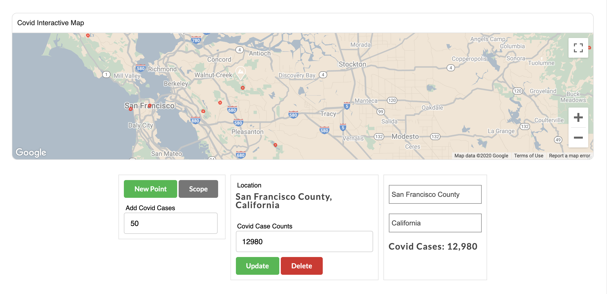
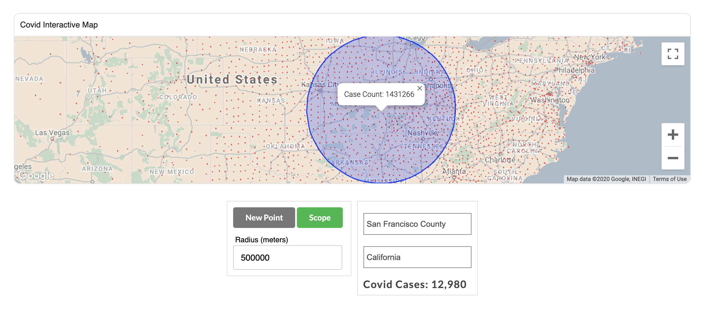

# Covid Interactive Map

> This module populates confirmed Covid cases in each United States county. Users can add, edit or delete covid locations or use the scope feature to see total number of Covid cases in an area.




## Table of Contents

1. [Usage](#Usage)
2. [Requirements](#requirements)
3. [Development](#development)
4. [Server Endpoints](#Server_Endpoints)
5. [Map Setup Explained](#Map_Setup_Explained)

## Usage

> Toggle "Scope" button and click on map to see accumulative covid cases within radius. Specify radius(meters) input to expand or minimize scope area.

> Toggle "New Point" button and click on map to add a new covid location. Modify "Add Covid Cases" input field to change the number of Covid cases to add at the new location.

> Click on any red circle Covid location on the map. A component will popup, allowing user to edit or delete Covid case numbers.

> Type in searchbar or select from options drop down to see total number of Covid cases at a particular location.

## Requirements

- Node > v12.14.0
- ruby 2.6.3
- rails 6.0.0.rc1


### Install Dependencies

Within the root directory:

```sh
yarn install
bundle install
```

### Run Service
Within the root directory:

```sh
rails s
```

## Development
```sh

Seed Database: rake db:seed

Require Google Maps Javascript API key.
Enable Google Maps & Geocoding API service.
Create a .env file in the root directory, with the following properties:
REACT_APP_GOOGLE_API_KEY = INSERT YOUR GOOGLE MAP API KEY

```

## Server Endpoints <a name="Server_Endpoints"></a>

```sh
get - /api/v1/covidpoints.json
post - /api/v1/covidpoints/
delete - /api/v1/covidpoints/:id
edit - /api/v1/covidpoints/:id
```

## Map Setup Explained<a name="Map_Setup_Explained"></a>

This app utilizes Google Maps Javascript API. When the Map.jsx component is loaded, a fetch request is created to collect Covid Case data. Upon completion of the of fetch, the google map api script is loaded. The script includes a callback that will create the map object and run through subsequent map setups.